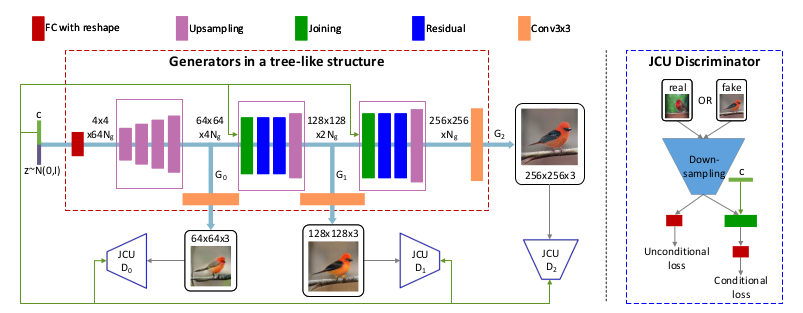

# StackGAN++



### Realistic Image Synthesis with Stacked Generative Adversarial Networks

This is my **PyTorch** implementation of StackGAN++ as it is delineated in the paper and the official repo. I attempted to implement it in a configurable way so as to allow for easy experimentation, e.g. I easily set it up afterwards to include a contrastive loss or for Zero-shot Learning. Check out the [paper](https://ieeexplore.ieee.org/abstract/document/8411144/?casa_token=Q23wQ253kzMAAAAA:aTAyMTOs1v-rIpblUjvBQW36XioeybXfr2Ap-l9dgjZzKsKVowBOYzYDmSHl8XJ6OkVBcBhqCA) (where I got the above image from) and show some love to the authors at their [official repo](https://github.com/hanzhanggit/StackGAN-v2).

## Datasets

Download datasets from links in the official repo. The dataset classes expect your dataset directory to be something like:

```
CUB
 |
 |- images
 |     |
 |     |- 001.Black_footed_Albatross
 |     |            |
 |     |            |- Black_footed_Albatross_#.jpg
 |     |            |- ...
 |     |- ...
 |
 |- embeddings
 |      |
 |      |- char-CNN-RNN-embeddings.pickle
 |      |- class_info.pickle
 |      |- filenames.pickle
 |
 |- ...other necessary CUB stuff...
```

## StackGAN++ code

The StackGAN class can be found in `stackgan/modules/stackgan_v2.py`, its training routine in `stackgan/training/stackgan_v2.py` and all other necessary components can be traced via the imports in these files. To train a StackGAN++, you can use the script `scripts/train_stackgan_v2`, after configuring the parameters in it to your liking and configuration. Logs and PyTorch models are created automatically. All you need to use the trained model afterwards is to create a StackGAN class instance and load the corresponding `.pt` file. Happy hacking!
